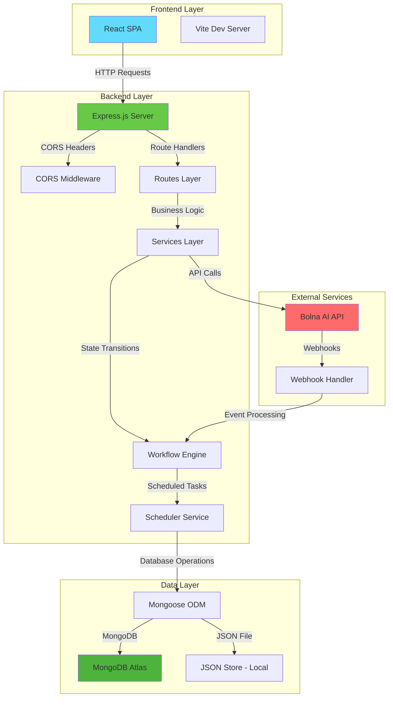
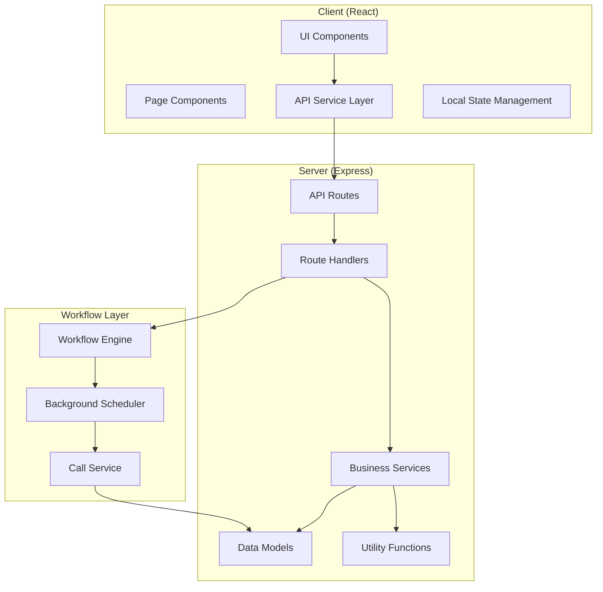
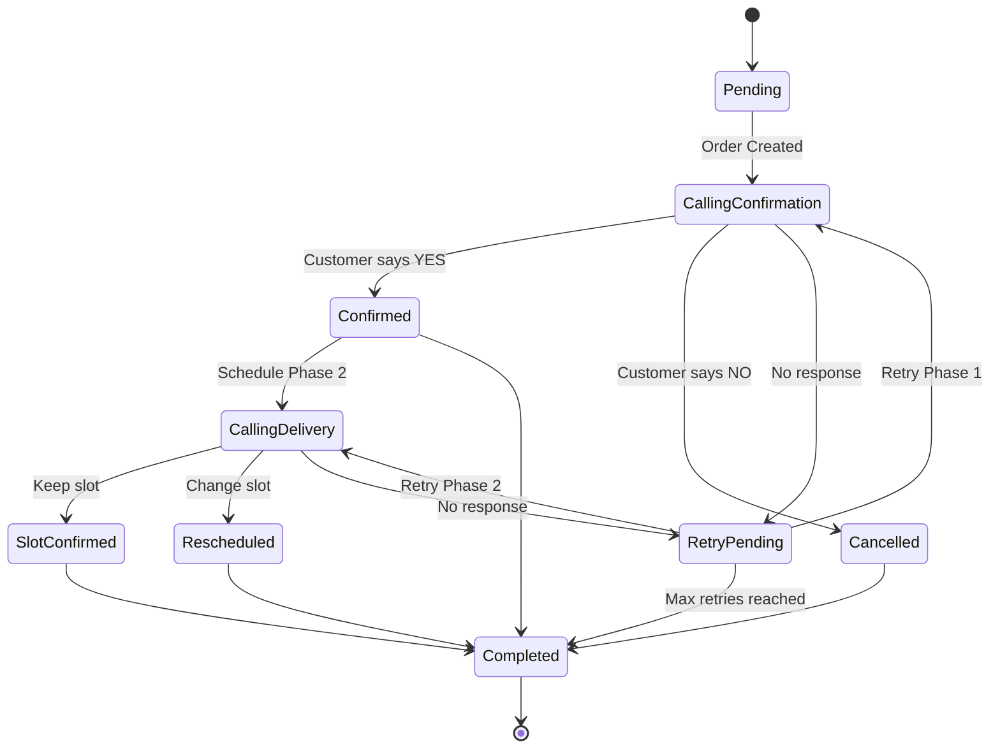
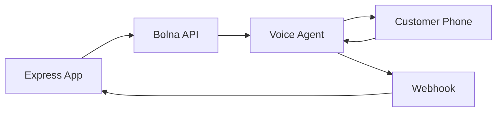

# Voice-Driven Commerce Operations Engine - Detailed Project Documentation

## Table of Contents
1. [Project Overview](#project-overview)
2. [What the Project Does](#what-the-project-does)
3. [How It Works](#how-it-works)
4. [System Architecture](#system-architecture)
5. [Technology Stack](#technology-stack)
6. [Detailed Code Explanation](#detailed-code-explanation)
7. [API Routes and Endpoints](#api-routes-and-endpoints)
8. [Database Schema and Models](#database-schema-and-models)
9. [Workflow Engine](#workflow-engine)
10. [Bolna AI Integration](#bolna-ai-integration)
11. [Production Deployment](#production-deployment)
12. [Testing Strategy](#testing-strategy)
13. [Problems Faced and Solutions](#problems-faced-and-solutions)
14. [Future Improvements](#future-improvements)
15. [System Design Considerations](#system-design-considerations)

## Project Overview

This is a **Voice-Driven Commerce Operations Engine** built as a full-stack application that automates Cash on Delivery (COD) order workflows using voice AI. The system integrates with Bolna AI to make automated phone calls for order confirmation and delivery scheduling, providing real-time dashboard updates and call logging.

The project was built to demonstrate modern full-stack development practices, including:
- React frontend with real-time updates and dashboard polling
- Express.js backend with workflow automation
- MongoDB/MongoDB Atlas for data persistence
- Voice AI integration via Bolna API with webhook handling
- Event-driven architecture with webhooks
- Polished UI with iconography, improved forms, modern cards, and status badges
- CORS handling for cross-origin requests

## What the Project Does

The application enables e-commerce businesses to:
1. **Create COD Orders**: Users can place orders with customer details, product info, and delivery addresses
2. **Automated Voice Confirmation**: System automatically calls customers to confirm orders using AI voice agents
3. **Delivery Slot Scheduling**: After confirmation, system calls again to schedule delivery slots
4. **Real-time Dashboard**: Operations team can monitor order status, call logs, and workflow progress with continuous polling refresh
5. **Retry Logic**: Handles failed calls with configurable retry attempts and delays
6. **Multi-language Support**: Supports English and Hindi for voice interactions
7. **Visual UX Improvements**: Polished dashboard UI, compact intro cards, wider forms, icon-rich metric summaries, hoverable tables, and a branded footer

### Core Features
- **Order Management**: CRUD operations for orders
- **Voice AI Integration**: Automated phone calls via Bolna AI
- **Workflow Automation**: State machine for order lifecycle
- **Real-time Updates**: Frontend polls for status changes
- **Call Logging**: Detailed transcripts and call metadata
- **Simulation Mode**: Local testing without actual phone calls

## How It Works

### High-Level Flow
1. **Order Creation**: User submits order form → Order saved to database with "Pending" status
2. **Phase 1 Call**: Scheduler triggers Bolna AI call for order confirmation
3. **Customer Response**: AI interprets voice response (yes/no/no-answer)
4. **Status Update**: Order status changes based on response
5. **Phase 2 Call**: If confirmed, scheduler triggers delivery slot call
6. **Final Status**: Order completes with delivery scheduled or cancelled

### Workflow States
```
Pending → Calling - Confirmation → Confirmed/Cancelled/Retry Pending
                                    ↓
                              Calling - Delivery Slot → Slot Confirmed/Rescheduled/Retry Pending → Completed
```

## System Architecture

### Architecture Diagram



### Component Architecture



## Technology Stack

### Frontend
- **React 19**: Modern React with hooks and functional components
- **React Router**: Client-side routing for SPA navigation
- **Axios**: HTTP client for API communication
- **Vite**: Fast build tool and dev server
- **Polling**: Live data refresh on the dashboard every few seconds
- **CSS Modules**: Scoped styling

### Backend
- **Node.js**: JavaScript runtime
- **Express.js**: Web framework for API development
- **CORS**: Cross-origin resource sharing middleware
- **Morgan**: HTTP request logging
- **Dotenv**: Environment variable management

### Database
- **MongoDB Atlas**: Cloud-hosted NoSQL database
- **Mongoose**: ODM for MongoDB with schema validation
- **JSON File Store**: Local file-based storage for development

### External Services
- **Bolna AI**: Voice AI platform for automated calls
- **Webhook Integration**: Event-driven communication

### Development Tools
- **Nodemon**: Auto-restart for development
- **Concurrently**: Run multiple processes simultaneously
- **ESLint**: Code linting
- **Prettier**: Code formatting

## Detailed Code Explanation

### Backend Entry Point (`server/src/index.js`)

```javascript
const { env } = require("./config/env");
const { connectDb } = require("./config/db");
const { app } = require("./app");
const { startScheduler } = require("./services/schedulerService");

const bootstrap = async () => {
  // Check for production warnings
  if (env.isProduction && env.storageMode === "json") {
    console.warn(
      "[Startup] WARNING: production deployment is using JSON storage. This is not recommended for production and may fail if the filesystem is read-only."
    );
  }
  
  // Connect to database (MongoDB or skip for JSON mode)
  await connectDb();
  
  // Start the background scheduler for workflow processing
  startScheduler();
  
  // Start the Express server
  app.listen(env.port, () => {
    console.log(`Backend running on http://localhost:${env.port}`);
    console.log(`Storage mode: ${env.storageMode}`);
  });
};

// Handle startup errors gracefully
bootstrap().catch((err) => {
  console.error("Server bootstrap failed:", err.message);
  process.exit(1);
});
```

**Why async?** The `bootstrap` function is async because database connection (`connectDb`) and potentially other initialization steps might be asynchronous. Using `async/await` ensures proper sequencing and error handling.

### Application Setup (`server/src/app.js`)

```javascript
const express = require("express");
const cors = require("cors");
const morgan = require("morgan");
const { env } = require("./config/env");
const ordersRoutes = require("./routes/orders");
const webhookRoutes = require("./routes/webhook");
const callsRoutes = require("./routes/calls");

const app = express();

// Enable CORS for frontend communication
app.use(cors({ origin: env.frontendUrl }));

// Special handling for Bolna webhooks - raw body needed for HMAC verification
app.use("/api/webhook/bolna", express.raw({ type: "application/json" }));

// Parse JSON for other routes
app.use(express.json());

// HTTP request logging
app.use(morgan("dev"));

// Health check endpoint
app.get("/api/health", (_req, res) => {
  res.json({ ok: true, service: "voice-commerce-backend" });
});

// Mount route handlers
app.use("/api/orders", ordersRoutes);
app.use("/api/webhook", webhookRoutes);
app.use("/api/calls", callsRoutes);

module.exports = { app };
```

**CORS Configuration**: `cors({ origin: env.frontendUrl })` restricts cross-origin requests to only the specified frontend URL, preventing unauthorized access while allowing the React app to communicate with the API.

**Raw Body for Webhooks**: Bolna webhooks require raw JSON body for signature verification. Express's default JSON parser would consume the body, so we use `express.raw()` for webhook routes.

### Order Model (`server/src/models/Order.js`)

```javascript
const mongoose = require("mongoose");

// Transcript sub-schema for call logs
const transcriptSchema = new mongoose.Schema(
  {
    speaker: { type: String, required: true }, // "agent" or "customer"
    text: { type: String, required: true },
  },
  { _id: false } // No separate _id for sub-documents
);

// Call log sub-schema
const callLogSchema = new mongoose.Schema(
  {
    phase: { type: Number, required: true }, // 1 or 2
    callId: { type: String, required: true },
    status: { type: String, required: true }, // "initiated", "completed", etc.
    response: { type: String, default: "pending" }, // AI decision
    durationSec: Number,
    timestamp: { type: Date, default: Date.now },
    newSlot: String, // Updated delivery slot
    transcript: [transcriptSchema], // Conversation transcript
  },
  { _id: false }
);

// Main order schema
const orderSchema = new mongoose.Schema(
  {
    customer: {
      name: { type: String, required: true },
      phone: { type: String, required: true },
    },
    product: {
      name: { type: String, required: true },
      amount: { type: Number, required: true },
    },
    address: { type: String, required: true },
    language: { type: String, enum: ["en", "hi"], default: "en" },
    status: { type: String, default: "Pending" },
    deliverySlot: { type: String, default: null },
    workflowPhase: { type: Number, default: 1 },
    retryCount: { type: Number, default: 0 },
    maxRetries: { type: Number, default: 2 },
    nextActionAt: { type: Date, default: null }, // Scheduler timestamp
    callLogs: [callLogSchema],
  },
  { timestamps: true } // Automatic createdAt/updatedAt
);

module.exports = mongoose.model("Order", orderSchema);
```

**Schema Design**: Uses embedded sub-documents for call logs to maintain data locality and avoid complex joins. The `timestamps: true` option automatically adds `createdAt` and `updatedAt` fields.

### Workflow Engine (`server/src/workflow/workflowEngine.js`)

```javascript
const { env } = require("../config/env");
const { getOrder, updateOrder } = require("../data/store");
const { triggerBolnaCall, applyWebhookDecision, deliveryDefault } = require("../services/callService");
const { schedulePhaseTwoCall } = require("../services/schedulerService");

// Generate metadata for call context
const callMetadata = (order, phase) => ({
  orderId: order.id,
  phase,
  customerName: order.customer.name,
  productName: order.product.name,
  amount: order.product.amount,
  ...(phase === 2 && { deliverySlot: order.deliverySlot || deliveryDefault }),
});

// Trigger order creation workflow
const emitOrderCreated = async (orderId) => {
  const order = await getOrder(orderId);
  if (!order) return null;
  
  // Set initial status and schedule immediate action
  await updateOrder(orderId, {
    status: "Pending",
    workflowPhase: 1,
    nextActionAt: new Date().toISOString(), // Immediate scheduling
  });
  
  return getOrder(orderId);
};

// Process call completion events
const emitCallCompleted = async ({ orderId, phase, response, callId, durationSec, transcript }) => {
  const result = await applyWebhookDecision({
    orderId,
    phase,
    response,
    callId,
    durationSec,
    transcript,
  });
  
  if (!result) return null;
  const { order: updated, duplicate } = result;
  
  // If confirmed, schedule phase 2
  if (!duplicate && updated.status === "Confirmed") {
    await schedulePhaseTwoCall(orderId);
  }
  
  // Handle retries
  if (!duplicate && updated.status === "Retry Pending" && updated.retryCount < updated.maxRetries) {
    await updateOrder(orderId, {
      nextActionAt: new Date(Date.now() + env.retryDelayMinutes * 60 * 1000).toISOString(),
    });
  }
  
  return getOrder(orderId);
};

module.exports = { emitOrderCreated, emitCallCompleted };
```

**Event-Driven Design**: The workflow engine acts as an event processor, responding to order creation and call completion events. This decouples the business logic from the API routes.

### Scheduler Service (`server/src/services/schedulerService.js`)

```javascript
const { env } = require("../config/env");
const { getOrder, getOrdersNeedingAction, updateOrder } = require("../data/store");
const { triggerBolnaCall, deliveryDefault } = require("./callService");

let intervalHandle = null;
let isProcessing = false;

// Schedule next action at specific time
const scheduleNextAction = async (orderId, whenIso) => {
  await updateOrder(orderId, { nextActionAt: whenIso });
};

// Schedule phase 2 call after delay
const schedulePhaseTwoCall = async (orderId) => {
  const delayMs = env.simulationMode ? 30000 : env.phase2DelayMinutes * 60 * 1000;
  await scheduleNextAction(orderId, new Date(Date.now() + delayMs).toISOString());
};

// Schedule retry with delay
const scheduleCallRetry = async (orderId, status) => {
  await updateOrder(orderId, {
    status,
    nextActionAt: new Date(Date.now() + env.retryDelayMinutes * 60 * 1000).toISOString(),
  });
};

// Main processing loop - runs every workflowTickMs
const processPendingActions = async () => {
  if (isProcessing) return; // Prevent concurrent execution
  isProcessing = true;
  
  try {
    const dueOrders = await getOrdersNeedingAction(new Date());
    
    for (const order of dueOrders) {
      if (order.status === "Pending") {
        // Start phase 1 confirmation call
        try {
          await updateOrder(order.id, {
            status: "Calling - Confirmation",
            nextActionAt: null,
            workflowPhase: 1,
          });
          const fresh = await getOrder(order.id);
          await triggerBolnaCall({
            order: fresh,
            phase: 1,
            metadata: { /* call context */ },
          });
        } catch {
          await scheduleCallRetry(order.id, "Calling - Confirmation");
        }
        continue;
      }
      
      if (order.status === "Confirmed") {
        // Start phase 2 delivery call
        try {
          await updateOrder(order.id, {
            status: "Calling - Delivery Slot",
            nextActionAt: null,
            workflowPhase: 2,
          });
          const fresh = await getOrder(order.id);
          await triggerBolnaCall({
            order: fresh,
            phase: 2,
            metadata: { /* call context */ },
          });
        } catch {
          await scheduleCallRetry(order.id, "Calling - Delivery Slot");
        }
        continue;
      }
      
      // Handle retries
      if (order.status === "Retry Pending" && order.retryCount < order.maxRetries) {
        const phase = order.workflowPhase || 1;
        await updateOrder(order.id, {
          status: phase === 1 ? "Calling - Confirmation" : "Calling - Delivery Slot",
          nextActionAt: null,
          retryCount: order.retryCount + 1,
        });
        const fresh = await getOrder(order.id);
        try {
          await triggerBolnaCall({
            order: fresh,
            phase,
            metadata: { /* call context */ },
          });
        } catch {
          await scheduleCallRetry(
            order.id,
            phase === 1 ? "Calling - Confirmation" : "Calling - Delivery Slot"
          );
        }
      }
    }
  } finally {
    isProcessing = false;
  }
};

// Start/stop the scheduler
const startScheduler = () => {
  if (intervalHandle) return;
  intervalHandle = setInterval(processPendingActions, env.workflowTickMs);
};

const stopScheduler = () => {
  if (intervalHandle) clearInterval(intervalHandle);
  intervalHandle = null;
};

module.exports = { schedulePhaseTwoCall, startScheduler, stopScheduler, processPendingActions };
```

**Background Processing**: Uses `setInterval` to run a processing loop every 10 seconds (configurable). The `isProcessing` flag prevents overlapping executions.

**Why Async?** All database operations and API calls are asynchronous, so the entire processing function is async to handle promises properly.

### Call Service (`server/src/services/callService.js`)

```javascript
const axios = require("axios");
const { env } = require("../config/env");
const { appendCallLog, updateOrder, getOrder } = require("../data/store");
const { prompts, fillTemplate } = require("../utils/prompts");

// Default delivery slots
const deliveryDefault = "Tomorrow 2-5 PM";
const deliveryRescheduled = "Day after tomorrow 10 AM - 1 PM";

// Infer response from webhook data
const inferResponse = (phase, response) => {
  const value = (response || "").toLowerCase();
  if (phase === 1) {
    // Match confirmation keywords
    if (["yes", "confirm", "haan", "confirmed", "theek hai", "bilkul", "rakh lo", "ji haan", "kar do", "karo", "ho jaye"].some(w => value.includes(w))) {
      return "confirmed";
    }
    if (["no", "cancel", "nahi", "band karo", "nahi chahiye", "ji nahi", "mat karo", "cancel karo"].some(w => value.includes(w))) {
      return "cancelled";
    }
    return "no-response";
  }
  // Phase 2 logic for delivery slots
  if (["reschedule", "change", "alag", "different", "dusra", "baad mein", "kal", "later", "nahi"].some(w => value.includes(w))) {
    return "rescheduled";
  }
  if (["keep", "ok", "theek", "thik", "yes", "same", "rakhna", "bilkul", "haan", "confirmed", "same slot"].some(w => value.includes(w))) {
    return "kept";
  }
  return "no-response";
};

// Build Bolna API payload
const buildCallPayload = ({ order, phase, promptText, callId, metadata }) => {
  // Extract and normalize data
  const oid = String(metadata?.orderId || order.id || order._id || "");
  const phaseVal = Number(metadata?.phase || phase);
  const callIdVal = String(metadata?.callId || callId);
  const slotForAgent = metadata?.deliverySlot ?? order.deliverySlot ?? (phaseVal === 2 ? deliveryDefault : null);
  
  // Prepare recipient data for AI context
  const recipientData = {
    orderId: oid,
    phase: phaseVal,
    callId: callIdVal,
    customer_name: metadata?.customerName || order.customer.name,
    product_name: metadata?.productName || order.product.name,
    amount: metadata?.amount ?? order.product.amount,
    amount_rupees: `₹${metadata?.amount ?? order.product.amount}`,
    order_summary: `Your order for ${metadata?.productName || order.product.name} worth ₹${metadata?.amount ?? order.product.amount}`,
    ...(phaseVal === 2 && slotForAgent ? { delivery_slot: slotForAgent } : {}),
  };
  
  // Main API payload
  const payload = {
    agent_id: validateBolnaAgentId(phaseVal),
    recipient_phone_number: String(order.customer.phone || "").trim(),
    user_data: {
      ...recipientData,
      prompt: promptText,
    },
  };
  
  // Optional configurations
  if (env.bolnaFromPhoneNumber) {
    payload.from_phone_number = env.bolnaFromPhoneNumber;
  }
  if (env.bolnaVoiceId) {
    payload.agent_data = { voice_id: env.bolnaVoiceId };
  }
  
  return payload;
};

// Trigger call via Bolna API
const triggerBolnaCall = async ({ order, phase, metadata }) => {
  if (!order?.customer?.phone) {
    throw new Error("Order is missing customer phone number for Bolna call.");
  }
  
  // Generate prompt based on language and phase
  const language = order.language || "en";
  const promptSet = prompts[language] || prompts.en;
  const promptText = fillTemplate(phase === 1 ? promptSet.phase1 : promptSet.phase2, {
    name: order.customer.name,
    product: order.product.name,
    amount: order.product.amount,
  });
  
  const callId = metadata?.callId || `call_${Date.now()}_${Math.floor(Math.random() * 10000)}`;
  const payload = buildCallPayload({ order, phase, promptText, callId, metadata });
  const bolnaUrl = `${normalizeUrl(env.bolnaApiBaseUrl)}/call`;
  
  let providerCallId = callId;
  
  // Skip API call in simulation mode
  if (!env.bolnaApiKey) {
    if (!env.simulationMode) {
      throw new Error("BOLNA_API_KEY is missing. Set SIMULATION_MODE=true for local demo without Bolna.");
    }
  } else {
    // Make actual API call
    try {
      console.log("[Bolna] POST", bolnaUrl, { /* logging */ });
      const response = await axios.post(bolnaUrl, payload, {
        headers: { Authorization: `Bearer ${env.bolnaApiKey}`, "Content-Type": "application/json" },
        timeout: 15000,
      });
      providerCallId = response.data?.execution_id || response.data?.call_id || response.data?.id || callId;
      console.log("[Bolna] OK", { status: response.status, providerCallId });
    } catch (err) {
      // Handle API errors
      const status = err.response?.status;
      const data = err.response?.data;
      console.error("[Bolna] Call failed", { /* error details */ });
      if (status != null) {
        const message = status === 404 
          ? `Bolna 404: agent or endpoint not found for phase ${phase}. Check BOLNA_AGENT_ID_PHASE${phase} and BOLNA_API_BASE_URL.`
          : `Bolna call failed with status ${status}`;
        const error = new Error(message);
        error.status = status;
        error.data = data;
        throw error;
      }
      throw err;
    }
  }
  
  // Log the call initiation
  await appendCallLog(order.id, {
    phase,
    callId: providerCallId,
    status: "initiated",
    response: "pending",
    timestamp: new Date().toISOString(),
    transcript: [
      { speaker: "agent", text: promptText },
      { speaker: "system", text: "Call initiated via Bolna API" },
    ],
  });
  
  return providerCallId;
};

// Process webhook response
const applyWebhookDecision = async ({ orderId, phase, response, callId, durationSec = 40, transcript = [] }) => {
  const order = await getOrder(orderId);
  if (!order) return null;
  
  // Check for duplicate webhooks
  const existingCompleted = order.callLogs?.find(
    log => log.phase === phase && log.status === "completed" && (callId ? log.callId === callId : true)
  );
  if (existingCompleted) {
    console.log(`[CallService] Duplicate webhook for phase ${phase} and call ${callId} ignored`);
    return { order, duplicate: true };
  }
  
  // Infer decision from response
  const decision = inferResponse(phase, response);
  const patch = {};
  
  // Update order status based on phase and decision
  if (phase === 1) {
    if (decision === "confirmed") {
      patch.status = "Confirmed";
      patch.nextActionAt = null;
      patch.workflowPhase = 2;
    }
    if (decision === "cancelled") {
      patch.status = "Cancelled";
      patch.nextActionAt = null;
    }
    if (decision === "no-response") patch.status = "Retry Pending";
  }
  
  if (phase === 2) {
    if (decision === "rescheduled") {
      patch.status = "Rescheduled";
      patch.deliverySlot = deliveryRescheduled;
      patch.nextActionAt = null;
    } else if (decision === "kept") {
      patch.status = "Slot Confirmed";
      patch.deliverySlot = deliveryDefault;
      patch.nextActionAt = null;
    } else {
      patch.status = "Retry Pending";
    }
  }
  
  // Apply updates
  const updated = await updateOrder(orderId, patch);
  if (!updated) return null;
  
  // Log the completed call
  await appendCallLog(orderId, {
    phase,
    callId,
    status: "completed",
    response: decision,
    durationSec,
    timestamp: new Date().toISOString(),
    newSlot: patch.deliverySlot || null,
    transcript,
  });
  
  return { order: await getOrder(orderId), duplicate: false };
};

module.exports = {
  deliveryDefault,
  deliveryRescheduled,
  triggerBolnaCall,
  applyWebhookDecision,
};
```

**Response Inference**: The `inferResponse` function uses keyword matching to interpret natural language responses from voice transcripts. It handles both English and Hindi keywords for better localization.

**Error Handling**: Comprehensive error handling for API failures, with specific messages for common issues like missing agents or invalid endpoints.

## API Routes and Endpoints

### Orders Routes (`server/src/routes/orders.js`)

```javascript
const express = require("express");
const { env } = require("../config/env");
const { createOrder, listOrders, getOrder, updateOrder, deleteOrder } = require("../data/store");
const { emitOrderCreated, emitCallCompleted } = require("../workflow/workflowEngine");

const router = express.Router();

// E.164 phone number validation regex
const PHONE_E164 = /^\+[1-9]\d{9,14}$/;

// GET /api/orders - List all orders
router.get("/", async (_req, res) => {
  try {
    const orders = await listOrders();
    res.json({ orders });
  } catch (err) {
    console.error("[orders] GET /", err.message);
    res.status(500).json({ error: "Failed to list orders." });
  }
});

// POST /api/orders - Create new order
router.post("/", async (req, res) => {
  try {
    const { name, phone, product, amount, address, language = "en" } = req.body;
    
    // Validation
    if (!name || !phone || !product || !amount || !address) {
      return res.status(400).json({ error: "Missing required fields." });
    }
    
    const phoneNorm = String(phone).trim();
    if (!PHONE_E164.test(phoneNorm)) {
      return res.status(400).json({
        error: "Invalid phone. Use E.164 format, e.g. +919876543210.",
      });
    }
    
    // Create order
    const order = await createOrder({
      customer: { name, phone: phoneNorm },
      product: { name: product, amount: Number(amount) },
      address,
      language,
      status: "Pending",
      deliverySlot: null,
      workflowPhase: 1,
      retryCount: 0,
      maxRetries: env.maxRetries,
      nextActionAt: null,
    });
    
    if (!order) {
      throw new Error("Order creation failed: created order is null.");
    }
    
    // Trigger workflow
    const updated = await emitOrderCreated(order.id);
    return res.status(201).json({ order: updated });
  } catch (err) {
    console.error("[orders] POST /", err);
    res.status(500).json({ error: "Failed to create order." });
  }
});

// PATCH /api/orders/:id - Update order
router.patch("/:id", async (req, res) => {
  try {
    const order = await getOrder(req.params.id);
    if (!order) return res.status(404).json({ error: "Order not found." });
    const updatedOrder = await updateOrder(req.params.id, req.body);
    res.json({ order: updatedOrder });
  } catch (err) {
    console.error("[orders] PATCH /:id", err.message);
    res.status(500).json({ error: "Failed to update order." });
  }
});

// DELETE /api/orders/:id - Delete order
router.delete("/:id", async (req, res) => {
  try {
    const deleted = await deleteOrder(req.params.id);
    if (!deleted) return res.status(404).json({ error: "Order not found." });
    res.json({ message: "Order deleted successfully." });
  } catch (err) {
    console.error("[orders] DELETE /:id", err.message);
    res.status(500).json({ error: "Failed to delete order." });
  }
});

// POST /api/orders/:id/simulate - Simulate webhook for testing
router.post("/:id/simulate", async (req, res) => {
  try {
    const { scenario = "no-answer", phase = 1 } = req.body;
    
    // Map scenario to response
    const decision = scenario === "cancelled" ? "cancel" 
                     : scenario === "confirmed" ? "yes" 
                     : scenario === "rescheduled" ? "reschedule" 
                     : "no response";
    
    // Simulate call completion
    const order = await emitCallCompleted({
      orderId: req.params.id,
      phase: Number(phase),
      response: decision,
      callId: `sim_${Date.now()}`,
      durationSec: 25,
      transcript: [
        { speaker: "agent", text: "Simulation call transcript start." },
        { speaker: "customer", text: decision },
      ],
    });
    
    if (!order) return res.status(404).json({ error: "Order not found." });
    return res.json({ order });
  } catch (err) {
    console.error("[orders] POST /:id/simulate", err.message);
    res.status(500).json({ error: "Simulation failed." });
  }
});

module.exports = router;
```

**Why E.164 Validation?** E.164 is the international standard for phone numbers, ensuring compatibility with telecom systems and APIs like Bolna.

**Simulation Endpoint**: Allows testing workflow without actual phone calls, crucial for development and debugging.

### Webhook Routes (`server/src/routes/webhook.js`)

```javascript
const express = require("express");
const crypto = require("crypto");
const { env } = require("../config/env");
const { emitCallCompleted } = require("../workflow/workflowEngine");

const router = express.Router();

// Webhook signature verification (disabled for now)
const verifyWebhookSignature = () => {
  return true; // Bolna doesn't send HMAC signatures in current integration
};

// Extract metadata from webhook payload
const extractWebhookMetadata = (body) => {
  const recipientData = body.context_details?.recipient_data || body.context?.recipient_data || body.recipient_data || body.agent_context_details?.recipient_data || body.data?.recipient_data || body.recipientData || body.data?.recipientData || {};
  
  const parsedRecipientData = typeof recipientData === "string" ? (() => {
    try {
      return JSON.parse(recipientData);
    } catch {
      return { raw: recipientData };
    }
  })() : recipientData;
  
  console.log("[Webhook] Raw recipientData:", JSON.stringify(parsedRecipientData, null, 2));
  
  return {
    orderId: parsedRecipientData.orderId || parsedRecipientData.order_id || parsedRecipientData.order_id || body.orderId || body.order_id,
    phase: Number(parsedRecipientData.phase || parsedRecipientData.phase_number || 1),
    callId: parsedRecipientData.callId || parsedRecipientData.call_id || body.call_id || body.execution_id,
    recipientData: parsedRecipientData,
  };
};

// Parse structured response from various webhook formats
const parseStructuredResponse = (value) => {
  if (value == null) return { reply: "", intent: "", status: "", decision: "", raw: "" };
  
  if (typeof value === "object") {
    const reply = String(value.reply || value.text || value.message || value.output || value.outputText || value.answer || value.response || "");
    const intent = String(value.intent || value.action || value.final_decision || value.decision || value.status || value.result || value.outcome || "");
    const status = String(value.status || value.intent || value.action || value.final_decision || value.decision || value.result || value.outcome || "");
    const decision = intent || status || reply;
    return { reply, intent, status, decision, raw: JSON.stringify(value) };
  }
  
  if (typeof value !== "string") return { reply: String(value), intent: "", status: "", decision: String(value), raw: String(value) };
  
  const trimmed = value.trim();
  if (!trimmed) return { reply: "", intent: "", status: "", decision: "", raw: "" };
  
  if (/^[\[{]/.test(trimmed)) {
    try {
      return parseStructuredResponse(JSON.parse(trimmed));
    } catch {
      return { reply: trimmed, intent: "", status: "", decision: trimmed, raw: trimmed };
    }
  }
  
  return { reply: trimmed, intent: "", status: "", decision: trimmed, raw: trimmed };
};

// Extract response from webhook body
const getWebhookResponse = (body) => {
  return parseStructuredResponse(
    body.response || body.intent || body.status || body.decision || body.final_decision || body.call_status || body.callState || body.event || body.result || body.extracted_data || body.agent_extraction || body.custom_extractions || body.summary || body.data?.response || body.data?.decision || body.data?.status || body.data?.result || body.data?.output?.response || body.data?.output?.result || body.data?.output?.decision || body.data?.output?.status || body.data?.event || body.output?.response || body.output?.result || body.output?.decision || body.output?.status || body.output_text || body.text || body.message || body.answer || body.ai_response || body.response_object || body.reply || body.data || body.payload || body.metadata
  );
};

// Normalize transcript text
const normalizeTranscriptText = (transcript) => {
  if (!transcript) return "";
  if (typeof transcript === "string") return transcript;
  
  const extractText = (entry) => {
    if (typeof entry === "string") return entry;
    if (!entry || typeof entry !== "object") return "";
    return entry.text || entry.transcript || entry.content || entry.message || entry.response || entry.answer || entry.output || entry.payload || Object.values(entry).filter(v => typeof v === "string").join(" ") || "";
  };
  
  if (Array.isArray(transcript)) {
    return transcript.map(extractText).filter(Boolean).join(" \n");
  }
  
  if (typeof transcript === "object") {
    return extractText(transcript);
  }
  
  return String(transcript);
};

// Extract user transcript from full conversation
const extractUserTranscript = (transcriptText) => {
  if (!transcriptText) return "";
  
  const lines = transcriptText.split(/\r?\n/).map(l => l.trim()).filter(Boolean);
  
  const userLines = lines.filter(l => /^(user|customer|caller):/i.test(l));
  if (userLines.length > 0) {
    return userLines.map(l => l.replace(/^(user|customer|caller):/i, "").trim()).join(" ");
  }
  
  const assistantLines = lines.filter(l => /^(assistant|agent|bot):/i.test(l));
  const remainingLines = lines.filter(l => !/^(assistant|agent|bot|user|customer|caller):/i.test(l));
  
  const ignoredPromptPattern = /can i confirm this order|confirm this order for you|are you okay with this order|please confirm|should we place this order|confirm your order|confirm order/i;
  const filtered = remainingLines.filter(l => !ignoredPromptPattern.test(l));
  
  if (filtered.length > 0) {
    return filtered[filtered.length - 1];
  }
  
  if (lines.length > 0) {
    return lines[lines.length - 1];
  }
  
  return "";
};

// Normalize status values
const normalizeStatus = (value) => {
  if (!value) return "";
  return String(value).toLowerCase().trim();
};

// Check if status indicates lifecycle event
const isLifecycleStatus = (status) => {
  if (!status) return false;
  return ["initiated", "ringing", "in-progress", "in progress", "queued", "dialing", "connected", "started", "answered", "ongoing", "calling"].some(term => status.includes(term));
};

// Check if status indicates terminal state
const isTerminalStatus = (status) => {
  if (!status) return false;
  return ["completed", "call-disconnected", "disconnected", "hangup", "terminated", "busy", "no-answer", "no answer", "failed", "cancelled", "cancel"].some(term => status.includes(term));
};

// Extract intent from transcript
const extractIntent = (transcriptText, phase = 1) => {
  if (!transcriptText) return "";
  
  const cleaned = transcriptText.split(/\r?\n/).map(l => l.trim().replace(/^(user|customer|caller|agent|jarvis|bot):\s*/i, "")).filter(Boolean).join(" ").toLowerCase();
  
  const matchAny = (terms) => terms.some(term => cleaned.includes(term));
  
  if (phase === 1) {
    if (matchAny(["yes", "confirm", "okay", "ok", "sure", "haan", "ha", "confirmed", "theek hai", "thik hai", "bilkul", "rakh lo", "ji haan", "kar do", "karo", "ho jaye"])) {
      return "confirmed";
    }
    if (matchAny(["no", "cancel", "nahi", "band karo", "nahi chahiye", "ji nahi", "mat karo", "cancel karo"])) {
      return "cancelled";
    }
    return "no-response";
  }
  
  if (matchAny(["reschedule", "change", "alag", "different", "dusra", "baad mein", "kal", "later", "nahi"])) {
    return "rescheduled";
  }
  if (matchAny(["keep", "ok", "theek", "thik", "yes", "same", "rakhna", "bilkul", "haan", "confirmed", "same slot"])) {
    return "kept";
  }
  return "no-response";
};

// POST /api/webhook/bolna - Handle Bolna webhooks
router.post("/bolna", async (req, res) => {
  try {
    // Verify signature (disabled)
    if (!verifyWebhookSignature()) {
      return res.status(401).json({ error: "Invalid signature" });
    }
    
    // Parse raw body
    let body;
    try {
      body = JSON.parse(req.body);
    } catch (e) {
      console.error("[Webhook] Failed to parse body:", e.message);
      return res.status(400).json({ error: "Invalid JSON body" });
    }
    
    console.log("[Webhook] Received:", JSON.stringify(body, null, 2));
    
    // Extract metadata
    const { orderId, phase, callId, recipientData } = extractWebhookMetadata(body);
    
    if (!orderId) {
      console.error("[Webhook] Missing orderId in webhook");
      return res.status(400).json({ error: "Missing orderId" });
    }
    
    // Extract response and transcript
    const responseData = getWebhookResponse(body);
    const transcriptText = normalizeTranscriptText(body.transcript || body.transcription || body.conversation || body.call_transcript);
    const userTranscript = extractUserTranscript(transcriptText);
    
    // Build transcript array
    const transcript = [];
    if (transcriptText) {
      const lines = transcriptText.split(/\r?\n/).filter(l => l.trim());
      lines.forEach(line => {
        const match = line.match(/^(agent|customer|user|caller|assistant|bot|jarvis):\s*(.+)$/i);
        if (match) {
          transcript.push({ speaker: match[1].toLowerCase(), text: match[2].trim() });
        }
      });
    }
    
    // Extract call duration
    const durationSec = body.duration || body.call_duration || body.duration_seconds || body.call_duration_seconds || 40;
    
    // Determine final response
    let finalResponse = responseData.decision || userTranscript;
    if (!finalResponse && transcript.length > 0) {
      const customerLines = transcript.filter(t => t.speaker === "customer" || t.speaker === "user" || t.speaker === "caller");
      if (customerLines.length > 0) {
        finalResponse = customerLines[customerLines.length - 1].text;
      }
    }
    
    console.log("[Webhook] Processing:", { orderId, phase, callId, finalResponse, durationSec });
    
    // Process the call completion
    const order = await emitCallCompleted({
      orderId,
      phase,
      response: finalResponse,
      callId,
      durationSec,
      transcript,
    });
    
    if (!order) {
      return res.status(404).json({ error: "Order not found" });
    }
    
    res.json({ success: true, order });
  } catch (err) {
    console.error("[Webhook] Error:", err);
    res.status(500).json({ error: "Webhook processing failed" });
  }
});

module.exports = router;
```

**Webhook Robustness**: The webhook handler is designed to be extremely flexible, handling various payload formats from Bolna API as the integration evolves.

**Duplicate Prevention**: Checks for existing completed calls to prevent double-processing of webhooks.

## Database Schema and Models

### Order Schema Design

The order schema uses MongoDB with Mongoose ODM:

- **Embedded Call Logs**: Call logs are embedded as sub-documents to maintain data locality and avoid complex joins
- **Workflow State**: Fields like `status`, `workflowPhase`, `retryCount`, `nextActionAt` manage the state machine
- **Flexible Storage**: Supports both MongoDB and JSON file storage for different environments

### Repository Pattern

The `orderRepository.js` implements a repository pattern that abstracts data access:

```javascript
// Switch between storage modes
const listOrders = async () => {
  try {
    if (env.storageMode === "mongo") {
      const orders = await Order.find().sort({ createdAt: -1 }).lean();
      return orders.map(withId);
    }
    const db = await readDb();
    return db.orders.sort((a, b) => new Date(b.createdAt) - new Date(a).createdAt);
  } catch (err) {
    console.error("[Store] listOrders error:", err.message);
    return [];
  }
};
```

**Storage Mode Flexibility**: The repository can switch between MongoDB and JSON file storage based on environment configuration, allowing easy development setup.

## Workflow Engine

### State Machine Design

The workflow engine implements a finite state machine:



### Event-Driven Architecture

- **emitOrderCreated**: Triggered when order is created
- **emitCallCompleted**: Triggered when webhook is received
- **Scheduler**: Polls for due actions every 10 seconds

## Bolna AI Integration

### Integration Architecture



### API Integration Details

```javascript
// Trigger call
const response = await axios.post(`${bolnaApiBaseUrl}/call`, payload, {
  headers: { 
    Authorization: `Bearer ${bolnaApiKey}`,
    "Content-Type": "application/json" 
  },
  timeout: 15000,
});

// Payload structure
{
  agent_id: "phase-specific-agent-id",
  recipient_phone_number: "+91XXXXXXXXXX",
  user_data: {
    orderId: "order-id",
    phase: 1,
    customer_name: "John Doe",
    product_name: "iPhone 15",
    amount: 50000,
    prompt: "Hi John, this is ShopFast calling...",
  }
}
```

### Webhook Processing

Bolna sends webhooks with:
- Call metadata (orderId, phase, callId)
- Transcript of conversation
- AI-extracted response/intent
- Call duration and status

## Production Deployment

### Environment Configuration

Production uses:
- **MongoDB Atlas**: Cloud-hosted database
- **Render**: Hosting platform
- **Environment Variables**: Secure configuration
- **CORS**: Configured for production URLs

### Build Process

```json
// package.json scripts
{
  "dev": "concurrently \"npm run dev --prefix server\" \"npm run dev --prefix client\"",
  "build": "npm run build --prefix client",
  "start": "npm run start --prefix server"
}
```

### Deployment Checklist

- [ ] Set `STORAGE_MODE=mongo`
- [ ] Configure `MONGODB_URI`
- [ ] Set `BOLNA_API_KEY` and agent IDs
- [ ] Configure production URLs
- [ ] Enable webhook endpoints
- [ ] Test simulation mode first

## Testing Strategy

### Simulation Mode

The application includes comprehensive simulation capabilities:

```javascript
// Simulate call outcomes
POST /api/orders/:id/simulate
{
  "scenario": "confirmed", // "confirmed", "cancelled", "rescheduled", "no-answer"
  "phase": 1
}
```

### Testing Scenarios

1. **Happy Path**: Order → Confirm → Schedule → Complete
2. **Cancellation**: Order → Cancel → Complete
3. **Retries**: No response → Retry → Success/Fail
4. **Rescheduling**: Confirm → Reschedule → Complete
5. **Webhook Duplicates**: Ensure idempotent processing

### Local Development

- Use `SIMULATION_MODE=true` for testing without API calls
- JSON storage for easy data inspection
- Simulation endpoints for workflow testing

## Problems Faced and Solutions

### 1. Webhook Payload Variability
**Problem**: Bolna webhook payloads changed format during development, breaking parsing logic.

**Solution**: Implemented flexible parsing with multiple fallback paths and extensive logging.

```javascript
const getWebhookResponse = (body) => {
  return parseStructuredResponse(
    body.response || body.intent || body.status || /* 20+ fallback paths */ body.metadata
  );
};
```

### 2. Race Conditions in Scheduler
**Problem**: Multiple scheduler ticks could process the same order simultaneously.

**Solution**: Added `isProcessing` flag to prevent concurrent execution.

```javascript
const processPendingActions = async () => {
  if (isProcessing) return;
  isProcessing = true;
  // ... processing logic
  isProcessing = false;
};
```

### 3. Phone Number Validation
**Problem**: Inconsistent phone number formats caused API failures.

**Solution**: Implemented E.164 validation with clear error messages.

```javascript
const PHONE_E164 = /^\+[1-9]\d{9,14}$/;
```

### 4. Transcript Parsing Complexity
**Problem**: Voice transcripts came in various formats, making intent extraction difficult.

**Solution**: Built robust parsing logic with keyword matching for multiple languages.

### 5. Database Storage Flexibility
**Problem**: Needed different storage for development vs production.

**Solution**: Created repository pattern supporting both MongoDB and JSON file storage.

## Future Improvements

### 1. Enhanced AI Integration
- **Natural Language Processing**: Better intent recognition using ML models
- **Sentiment Analysis**: Detect customer satisfaction from voice
- **Multi-turn Conversations**: Handle complex dialogues

### 2. Advanced Workflow Features
- **Conditional Branching**: Support for custom workflow paths
- **Parallel Processing**: Multiple calls for different stakeholders
- **SLA Management**: Time-based escalation rules

### 3. Scalability Enhancements
- **Queue System**: Replace polling with event-driven queues (Redis/RabbitMQ)
- **Microservices**: Split into separate services for calls, orders, webhooks
- **Load Balancing**: Horizontal scaling support

### 4. User Experience
- **Real-time Notifications**: WebSocket integration for live updates
- **Bulk Operations**: Import/export orders, batch processing
- **Analytics Dashboard**: Detailed metrics and reporting
- **UI Polish and Visual Refinement**: improved dashboard hierarchy, wider forms, iconography, premium cards, and better table interaction

### 5. Security & Compliance
- **Webhook Authentication**: HMAC signature verification
- **Data Encryption**: Encrypt sensitive customer data
- **Audit Logging**: Comprehensive activity tracking
- **GDPR Compliance**: Data retention and deletion policies

### 6. Integration Capabilities
- **CRM Integration**: Sync with Salesforce/HubSpot
- **Payment Gateways**: Integration with Razorpay/Stripe
- **SMS/WhatsApp**: Multi-channel communication
- **Inventory Management**: Real-time stock updates

### 7. Monitoring & Observability
- **Application Metrics**: Prometheus/Grafana integration
- **Error Tracking**: Sentry for error monitoring
- **Performance Monitoring**: APM tools integration
- **Business Intelligence**: Advanced reporting and analytics

## System Design Considerations

### CORS Configuration
```javascript
app.use(cors({ origin: env.frontendUrl }));
```
**Why?** Prevents unauthorized cross-origin requests while allowing the React frontend to communicate with the API.

### Async/Await Usage
All I/O operations use async/await for:
- **Readability**: Cleaner than promise chains
- **Error Handling**: Try/catch blocks
- **Sequential Logic**: Database operations that depend on previous results

### Event-Driven Architecture
- **Decoupling**: API routes don't contain business logic
- **Testability**: Events can be tested independently
- **Scalability**: Easy to add new event handlers

### Repository Pattern
- **Abstraction**: Data access logic separated from business logic
- **Flexibility**: Easy to switch storage backends
- **Testing**: Mock repositories for unit tests

### State Machine Design
- **Predictability**: Clear state transitions
- **Debugging**: Easy to track order lifecycle
- **Extensibility**: New states can be added without breaking existing logic

This comprehensive documentation covers the entire Voice-Driven Commerce Operations Engine project, providing deep insights into its architecture, implementation, and evolution.