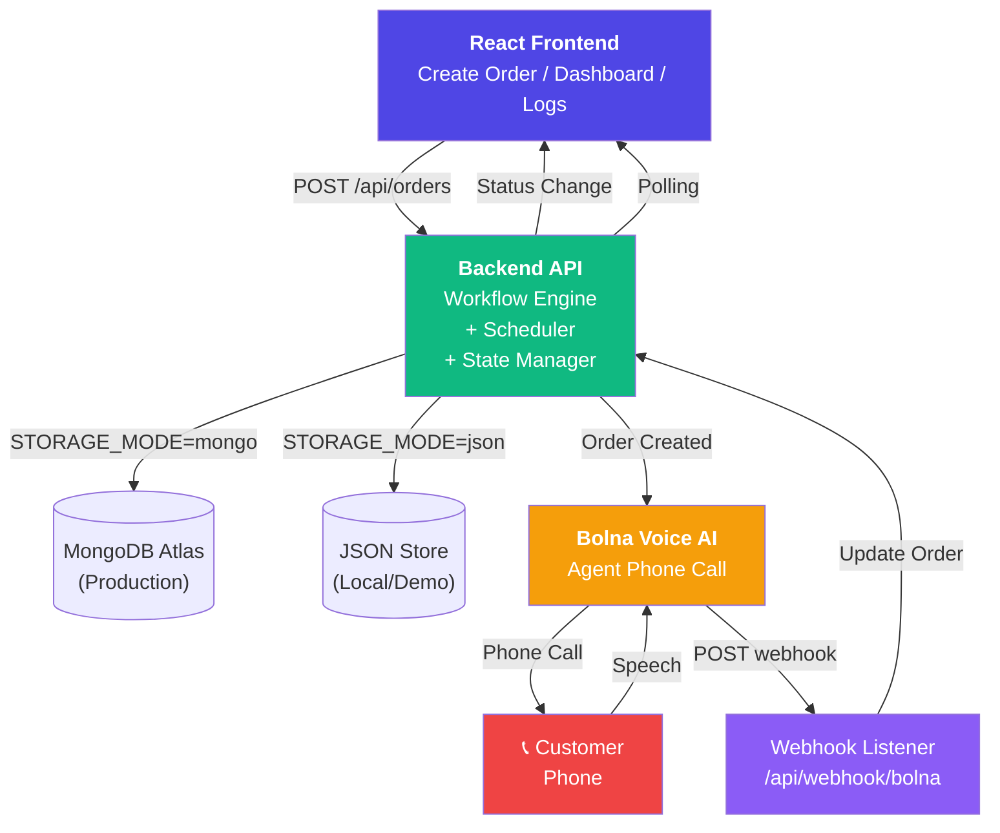
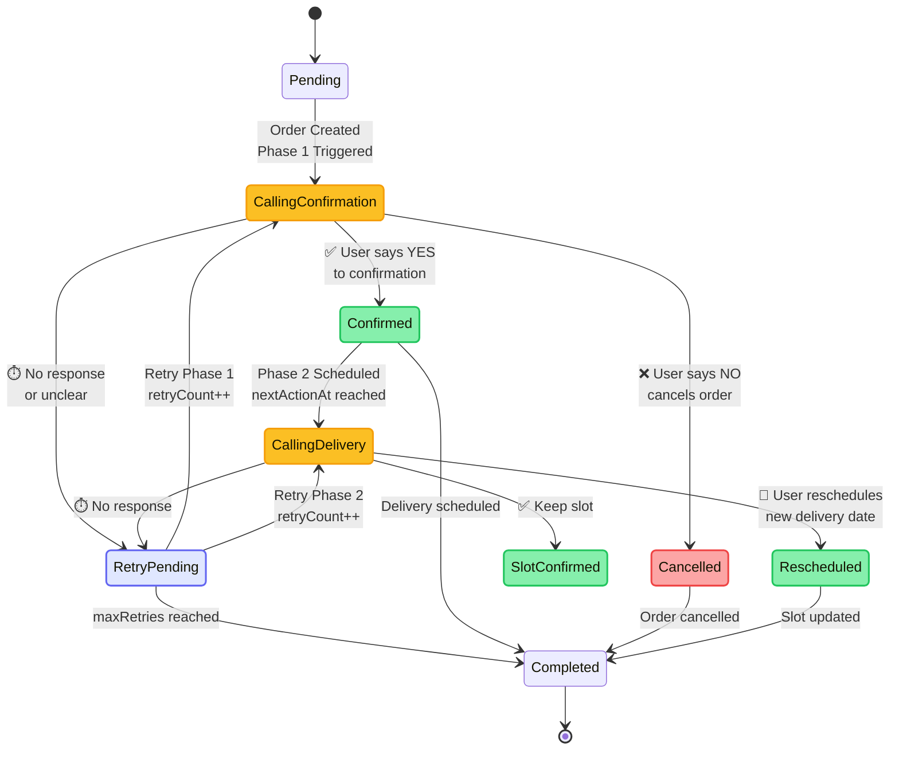
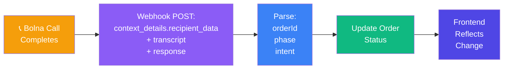

# Voice-Driven Commerce Operations Engine

COD voice operations: **confirm** → **schedule delivery** → **auto-update** dashboard and call logs.

A full-stack COD order workflow with voice confirmation and delivery scheduling. The app allows a user to create a COD order, sends a Phase 1 verification call via Bolna, and once confirmed, schedules a Phase 2 delivery slot call. The frontend dashboard updates status and call logs as the workflow progresses.

## What it does

| Phase | Voice goal | Outcomes |
|-------|-------------|----------|
| 1 | COD confirmation | Confirmed / Cancelled / Retry Pending |
| 2 | Delivery slot | Slot Confirmed / Rescheduled / Retry Pending |
| 3 | Ops visibility | Dashboard + call logs + `nextActionAt` scheduling |

## System design

### Complete Integration Flow



### Workflow architecture



### Webhook data flow



Statuses in the API use strings such as `Calling - Confirmation` and `Calling - Delivery Slot`; `workflowPhase` (1 or 2) decides which retry call is placed.

## Key features

- Order creation form with customer details, product, amount, address, and language selection
- Phone input requires `+91XXXXXXXXXX`
- Phase 1: voice confirmation call for COD order
- Phase 2: voice delivery slot confirmation/reschedule call after Phase 1 success
- Retry handling for missed/unclear calls
- Dashboard showing active operations and recent call activity
- Call log history and simulation endpoints for testing
- Supports local JSON storage or MongoDB production storage

## Project structure

- `client/` — React frontend built with Vite
- `server/` — Express backend, workflow engine, Bolna webhook handler, scheduler
- `package.json` — root scripts to run both client and server together

## Stack

- Frontend: React, Vite, React Router, Axios, Polling
- Backend: Node.js, Express, Mongoose(Optional)
- Storage: local JSON file or MongoDB
- Voice integration: Bolna voice API + webhook handling


## Installation

From the repository root:

```bash
npm install
npm install --prefix server
npm install --prefix client
```

## Run locally

Start both server and client together:

```bash
npm run dev
```

Or run each separately:

```bash
npm run dev --prefix server
npm run dev --prefix client
```

Then open:

- Frontend: `http://localhost:5173`
- Backend API: `http://localhost:5000`

## Build and start

Build the client:

```bash
npm run build --prefix client
```

Start the backend:

```bash
npm start --prefix server
```

## API endpoints

- `POST /api/orders` — create a new order and start Phase 1 workflow
- `GET /api/orders` — list all orders
- `PATCH /api/orders/:id` — update an order
- `DELETE /api/orders/:id` — delete an order
- `POST /api/orders/:id/simulate` — simulate call outcomes for demo/testing
- `POST /api/webhook/bolna` — receive Bolna webhook events
- `GET /api/calls` — list flattened call logs

## Bolna webhook behavior

Aligned with Voice-Driven-Commerce-Operations-Engine:

- Raw JSON body on POST /api/webhook/bolna so BOLNA_WEBHOOK_SECRET HMAC can use the exact request bytes (not JSON.stringify after parsing).
- Immediate 200 { ok, received } response, then async processing (Bolna-friendly timeouts/retries).
- Parses context_details.recipient_data (and fallbacks) for orderId / phase / callId.
- extractIntent() from transcript text (English + common Hindi tokens) when intent is missing.
- transcript.summary (object-shaped transcript) is merged into text and used as a fallback response when Bolna sends a summary only.
- Ignores events with no transcript (pings / partial payloads) so they do not mutate workflow state.
- Duplicate completed webhooks for the same phase are ignored (no double state transitions).

Outbound calls include recipient_data / user_data / extra_data so Bolna can echo identifiers back into webhooks. Phase 2 also sends delivery_slot / deliverySlot for dashboard agent templates (e.g. {{delivery_slot}}).

Scheduling: RETRY_DELAY_MINUTES controls retry spacing; PHASE2_DELAY_MINUTES (default 2) controls how long after confirmation the delivery call is scheduled in production (simulation still uses 30s). JSON file mode applies the same Confirmed / Retry Pending filter as Mongo when selecting due orders (fixes a common demo bug).

## Production (Render + MongoDB Atlas)

- Atlas: cluster + user + allow 0.0.0.0/0 (or Render IPs) → MONGODB_URI
- Render (backend): root server, build npm install, start npm start
- Set STORAGE_MODE=mongo, MONGODB_URI, APP_BASE_URL (Render URL), FRONTEND_URL (Render URL), Bolna vars from dashboard.
- Render (frontend): root client, VITE_API_URL=https://<render-host>/api
- Bolna: webhook = https://<render-host>/api/webhook/bolna

## Notes

- Phone input requires full `+91XXXXXXXXXX`; plain 10-digit numbers are rejected.
- The dashboard reflects active operations and call outcomes in real time through polling.
- Local JSON storage is suitable for demos but not production; use MongoDB for stable storage.
