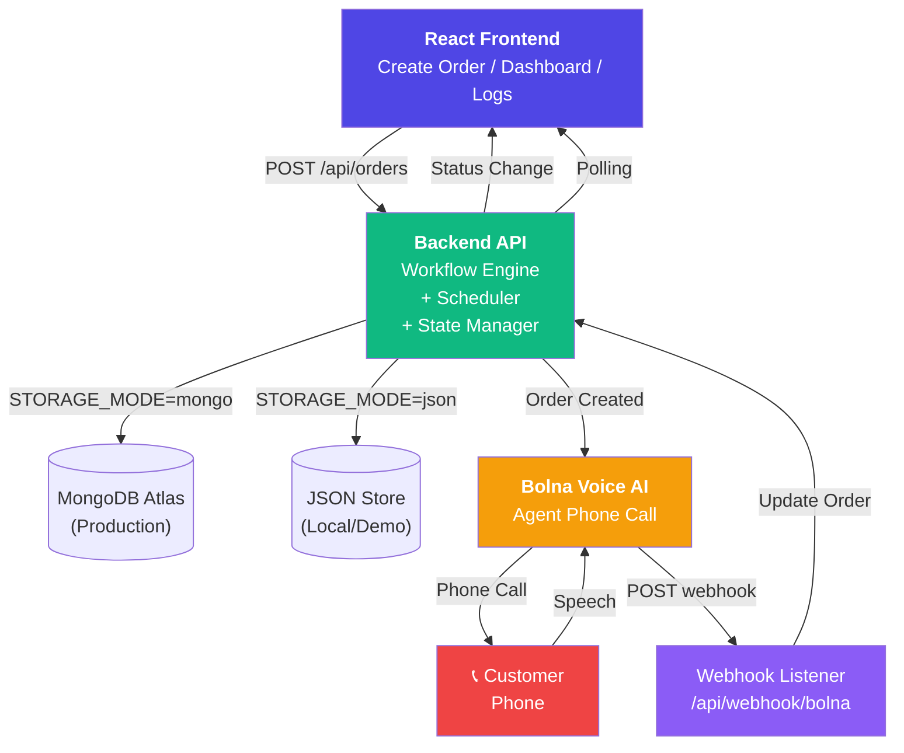
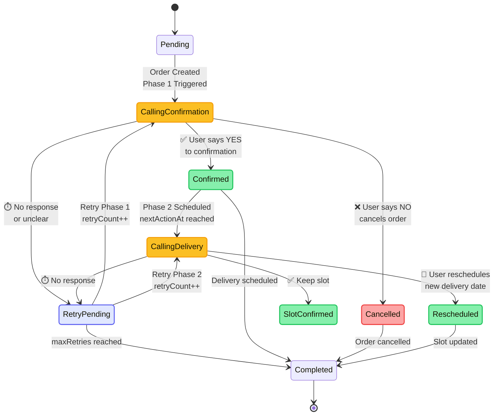
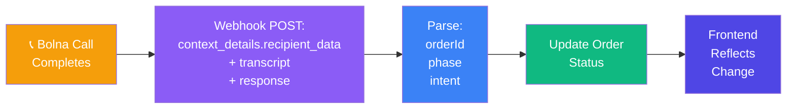

# Voice-Driven Commerce Operations Engine

COD voice operations: **confirm** → **schedule delivery** → **auto-update** dashboard and call logs.

A full-stack COD order workflow with voice confirmation and delivery scheduling. The app allows a user to create a COD order, sends a Phase 1 verification call via Bolna, and once confirmed, schedules a Phase 2 delivery slot call. The frontend dashboard updates status and call logs as the workflow progresses.

## What it does

| Phase | Voice goal | Outcomes |
|-------|-------------|----------|
| 1 | COD confirmation | Confirmed / Cancelled / Retry Pending |
| 2 | Delivery slot | Slot Confirmed / Rescheduled / Retry Pending |
| 3 | Ops visibility | Dashboard + call logs + `nextActionAt` scheduling |

## System design

### Complete Integration Flow



### Workflow architecture



### Webhook data flow



Statuses in the API use strings such as `Calling - Confirmation` and `Calling - Delivery Slot`; `workflowPhase` (1 or 2) decides which retry call is placed.

## Key features

- Order creation form with customer details, product, amount, address, and language selection
- Phone input requires `+91XXXXXXXXXX`
- Phase 1: voice confirmation call for COD order
- Phase 2: voice delivery slot confirmation/reschedule call after Phase 1 success
- Retry handling for missed/unclear calls
- Dashboard showing active operations and recent call activity
- Call log history and simulation endpoints for testing
- Supports local JSON storage or MongoDB production storage

## Project structure

- `client/` — React frontend built with Vite
- `server/` — Express backend, workflow engine, Bolna webhook handler, scheduler
- `package.json` — root scripts to run both client and server together

## Stack

- Frontend: React, Vite, React Router, Axios
- Backend: Node.js, Express, dotenv, optional Mongoose
- Storage: local JSON file or MongoDB
- Voice integration: Bolna voice API + webhook handling

## Environment setup

### `server/.env`

Required values:

- `PORT=5000`
- `FRONTEND_URL=http://localhost:5173`
- `APP_BASE_URL=http://localhost:5000`
- `STORAGE_MODE=json` or `mongo`
- `MONGODB_URI=` (when using `mongo`)
- `WORKFLOW_TICK_MS=10000`
- `RETRY_DELAY_MINUTES=1`
- `MAX_RETRIES=2`
- `SIMULATION_MODE=true`
- `BOLNA_API_KEY=`
- `BOLNA_API_BASE_URL=https://api.bolna.ai`
- `BOLNA_AGENT_ID_PHASE1=`
- `BOLNA_AGENT_ID_PHASE2=`
- `BOLNA_WEBHOOK_PATH=/api/webhook/bolna`
- `BOLNA_WEBHOOK_SECRET=`
- `NODE_ENV=development`

### `client/.env`

For the frontend to call the backend:

- `VITE_APP_BASE_URL=http://localhost:5000/api`

> The frontend validation requires the phone number to be entered in the full international format: `+91XXXXXXXXXX`.

## Installation

From the repository root:

```bash
npm install
npm install --prefix server
npm install --prefix client
```

## Run locally

Start both server and client together:

```bash
npm run dev
```

Or run each separately:

```bash
npm run dev --prefix server
npm run dev --prefix client
```

Then open:

- Frontend: `http://localhost:5173`
- Backend API: `http://localhost:5000`

## Build and start

Build the client:

```bash
npm run build --prefix client
```

Start the backend:

```bash
npm start --prefix server
```

## API endpoints

- `POST /api/orders` — create a new order and start Phase 1 workflow
- `GET /api/orders` — list all orders
- `PATCH /api/orders/:id` — update an order
- `DELETE /api/orders/:id` — delete an order
- `POST /api/orders/:id/simulate` — simulate call outcomes for demo/testing
- `POST /api/webhook/bolna` — receive Bolna webhook events
- `GET /api/calls` — list flattened call logs

## Workflow behavior

- New orders start as `Pending` and are immediately scheduled for a Phase 1 call.
- When Phase 1 succeeds, the order moves to `Confirmed` and Phase 2 is scheduled.
- If Phase 1 or Phase 2 receives no valid confirmation, the order can move to `Retry Pending` and retry later.
- Phase 2 handles delivery slot confirmation or rescheduling.

## Bolna webhook behavior

- Incoming webhook payloads are parsed from `context_details.recipient_data` and fallback fields.
- The webhook extracts `orderId`, `phase`, and `callId` to update the correct order workflow.
- It ignores lifecycle-only events like `initiated`, `ringing`, or `in-progress`.
- It infers user intent from transcript text when explicit intent fields are missing.
- Duplicate completed webhooks for the same phase are ignored.

## Production notes

- Use `STORAGE_MODE=mongo` and set `MONGODB_URI` for a persistent database in production.
- Set correct `APP_BASE_URL`, `FRONTEND_URL`, and Bolna webhook URL in your deployment.
- For Render/Vercel, frontend should point to backend API at `VITE_APP_BASE_URL=https://<backend-host>/api`.
- Keep `BOLNA_WEBHOOK_SECRET` configured if Bolna supports signing webhooks.

## Notes

- Phone input requires full `+91XXXXXXXXXX`; plain 10-digit numbers are rejected.
- The dashboard reflects active operations and call outcomes in real time through polling.
- Local JSON storage is suitable for demos but not production; use MongoDB for stable storage.
