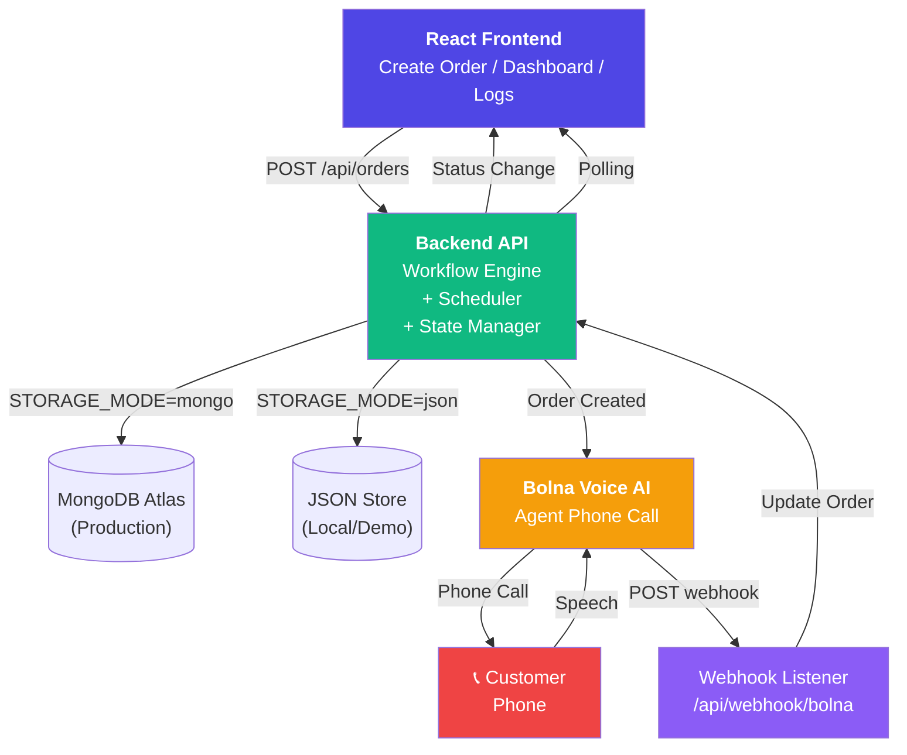
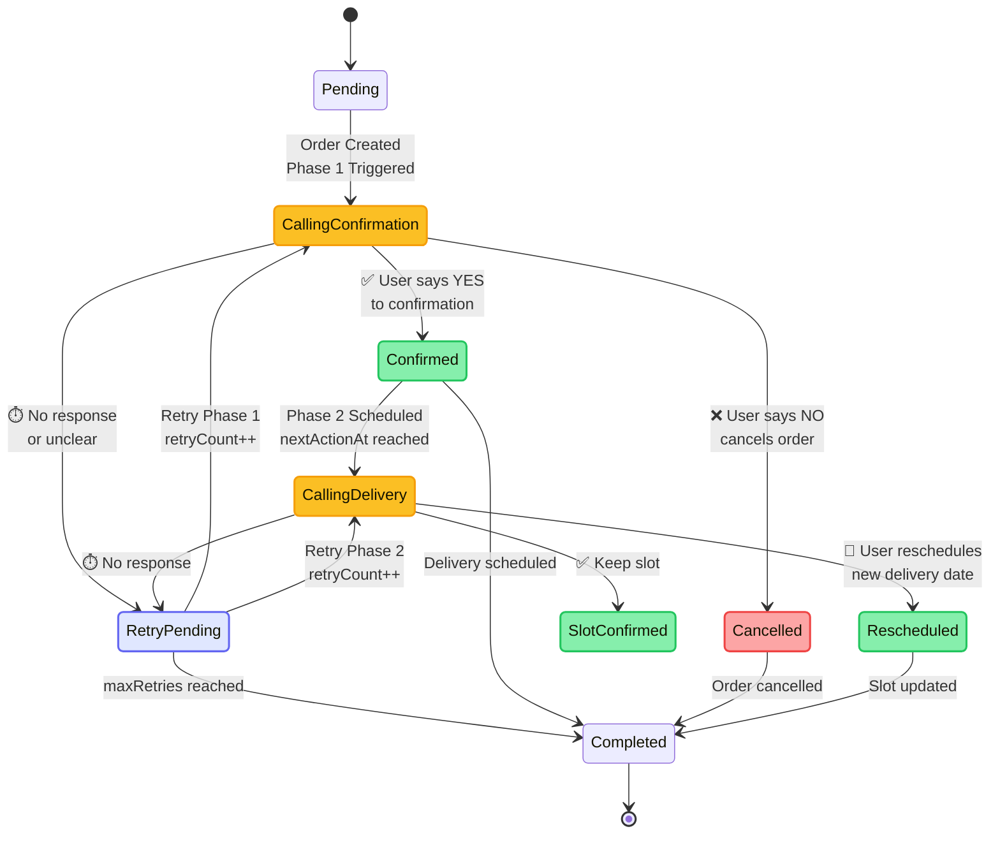
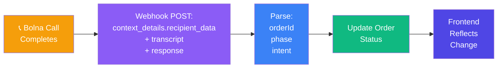

# Voice-Driven Commerce Operations Engine

COD voice operations: **confirm** → **schedule delivery** → **auto-update** dashboard and call logs.


## What it does

| Phase | Voice goal | Outcomes |
|-------|-------------|----------|
| 1 | COD confirmation | Confirmed / Cancelled / Retry Pending |
| 2 | Delivery slot | Slot Confirmed / Rescheduled / Retry Pending |
| 3 | Ops visibility | Dashboard + call logs + `nextActionAt` scheduling |

## System design

### Complete Integration Flow



### Workflow architecture



### Webhook data flow



Statuses in the API use strings such as `Calling - Confirmation` and `Calling - Delivery Slot`; `workflowPhase` (1 or 2) decides which retry call is placed.

## Stack

- **Frontend:** React (Vite), React Router, Axios, polling
- **Backend:** Node.js, Express, Mongoose (optional), Bolna REST + webhook
- **Storage:** `STORAGE_MODE=json` (local) or `STORAGE_MODE=mongo` (production)

## Quick start (local)

```bash
npm install
npm install --prefix server
npm install --prefix client
```

Copy `server/.env.example` → `server/.env` and set **`SIMULATION_MODE=true`** if you do not have Bolna keys yet.  
Copy `client/.env.example` → `client/.env` for production API URL, or use default localhost in `client/.env` (see repo’s local template).

```bash
npm run dev
```

- UI: `http://localhost:5173`  
- API: `http://localhost:5000`

## API

- `POST /api/orders` — create order + start workflow  
- `GET /api/orders`  
- `PATCH /api/orders/:id`  
- `POST /api/orders/:id/simulate` — demo success/failure paths  
- `POST /api/webhook/bolna` — Bolna outcomes (`metadata.orderId`, `metadata.phase`, …)  
- `GET /api/calls` — flattened logs  

## Bolna webhook (production-hardened)

Aligned with **Voice-Driven-Commerce-Operations-Engine1**:

- **Raw JSON body** on `POST /api/webhook/bolna` so `BOLNA_WEBHOOK_SECRET` HMAC can use the **exact request bytes** (not `JSON.stringify` after parsing).
- **Immediate `200 { ok, received }`** response, then **async** processing (Bolna-friendly timeouts/retries).
- Parses **`context_details.recipient_data`** (and fallbacks) for `orderId` / `phase` / `callId`.
- **`extractIntent()`** from transcript text (English + common Hindi tokens) when `intent` is missing.
- **`transcript.summary`** (object-shaped `transcript`) is merged into text and used as a fallback **response** when Bolna sends a summary only.
- **Ignores** events with **no transcript** (pings / partial payloads) so they do not mutate workflow state.
- **Duplicate** completed webhooks for the same phase are ignored (no double state transitions).

Outbound calls include **`recipient_data` / `user_data` / `extra_data`** so Bolna can echo identifiers back into webhooks. Phase 2 also sends **`delivery_slot`** / **`deliverySlot`** for dashboard agent templates (e.g. `{{delivery_slot}}`).

**Scheduling:** `RETRY_DELAY_MINUTES` controls retry spacing; **`PHASE2_DELAY_MINUTES`** (default 2) controls how long after confirmation the delivery call is scheduled in production (simulation still uses 30s). JSON file mode applies the same **`Confirmed` / `Retry Pending`** filter as Mongo when selecting due orders (fixes a common demo bug).

## Production (Render + MongoDB Atlas)

1. **Atlas:** cluster + user + allow `0.0.0.0/0` (or Render IPs) → `MONGODB_URI`  
2. **Render (backend):** root `server`, build `npm install`, start `npm start`  
   Set `STORAGE_MODE=mongo`, `MONGODB_URI`, `APP_BASE_URL` (Render URL), `FRONTEND_URL` (Vercel URL), Bolna vars from dashboard.  
3. **Vercel (frontend):** root `client`, `VITE_API_URL=https://<render-host>/api`  
4. **Bolna:** webhook = `https://<render-host>/api/webhook/bolna`  

## Engineering note

In-memory polling scheduler is fine for demos. For production scale, move delayed work to **BullMQ** or **Temporal**.
