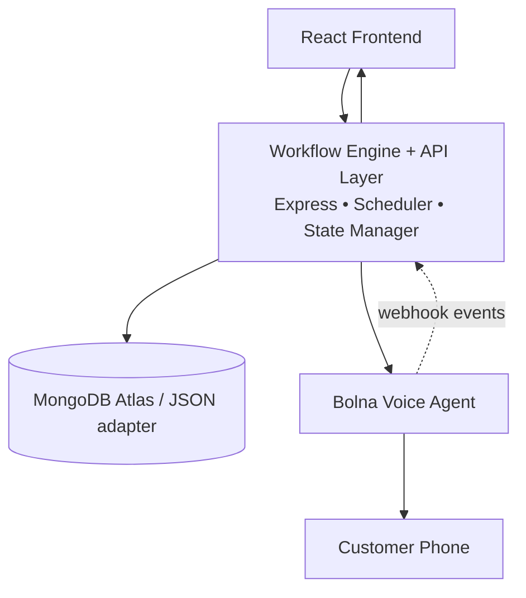
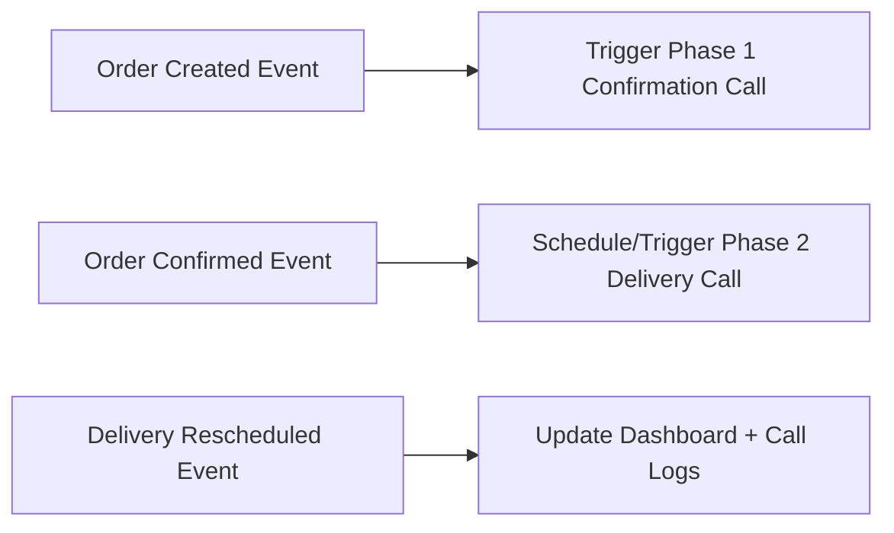
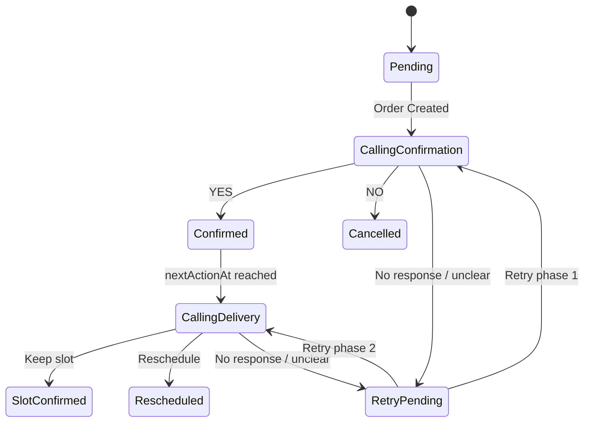

# Voice-Driven Commerce Operations Engine

Voice-first operations system for COD ecommerce workflows.

> **Positioning line for interview:**  
> The system is designed around workflow automation instead of chatbot interaction.

## What It Automates

- **Phase 1:** COD confirmation call (`Confirmed` / `Cancelled` / `Retry Pending`)
- **Phase 2:** Delivery slot call (`Keep` / `Rescheduled` / `Retry Pending`)
- **Phase 3:** Auto dashboard + call log + workflow state transitions

## System Design





## Workflow State Model



## Core Features

- Event-driven workflow logic (`Order Created`, `Call Completed`, `Retry Due`)
- Retry engine with:
  - `retryCount`
  - `maxRetries`
  - `nextActionAt`
- Real Bolna API integration path (`/v1/calls`) + webhook processing
- Transcript storage and "View Conversation" in call logs
- Dashboard sections:
  - Overview cards
  - Active operations table
  - Recent call activity
- Visual polish: status pulse animation + toast notifications
- Hindi/English prompt support

## Data Schema (Order)

```js
{
  customer: { name, phone },
  product: { name, amount },
  address,
  language,             // en | hi
  status,
  deliverySlot,
  retryCount,
  maxRetries,
  nextActionAt,
  callLogs: [
    { phase, callId, status, response, durationSec, timestamp, newSlot, transcript[] }
  ],
  createdAt,
  updatedAt
}
```

## Quick Start (Local)

```bash
npm install
npm install --prefix server
npm install --prefix client
```

Copy envs:

- `server/.env.example` -> `server/.env`
- `client/.env.example` -> `client/.env`

Run:

```bash
npm run dev
```

- Frontend: `http://localhost:5173`
- Backend: `http://localhost:5000`

## API

- `POST /api/orders` - Create order + emit `Order Created Event`
- `GET /api/orders` - List orders
- `PATCH /api/orders/:id` - Manual patch
- `POST /api/orders/:id/simulate` - Simulate failure/success scenarios
- `POST /api/webhook/bolna` - Bolna webhook event intake
- `GET /api/calls` - Flattened call logs

## Real Bolna Integration

Configure backend env:

- `BOLNA_API_KEY`
- `BOLNA_API_BASE_URL`
- `BOLNA_AGENT_ID_PHASE1`
- `BOLNA_AGENT_ID_PHASE2`
- `BOLNA_WEBHOOK_SECRET`
- `APP_BASE_URL` (public backend URL so Bolna can call webhook)

Webhook should send at least:

- `orderId` (or `metadata.orderId`)
- `phase` (or `metadata.phase`)
- `response` / `intent`
- `callId`
- optional `transcript`

## Production Deployment (Render + MongoDB Atlas)

1. Create Atlas cluster and copy `MONGODB_URI`.
2. Deploy backend on Render:
   - Root: `server`
   - Build: `npm install`
   - Start: `npm start`
   - Env: set all backend vars, especially:
     - `STORAGE_MODE=mongo`
     - `MONGODB_URI=<atlas-uri>`
     - `APP_BASE_URL=<render-backend-url>`
3. Deploy frontend on Vercel:
   - Root: `client`
   - Env: `VITE_API_URL=<render-backend-url>/api`
4. Put backend webhook URL into Bolna agent config:
   - `<APP_BASE_URL>/api/webhook/bolna`

## Engineering Note

For demo simplicity, delayed scheduling can be handled in-memory.  
In production, move scheduling/retry jobs to a persistent queue (BullMQ / Temporal).